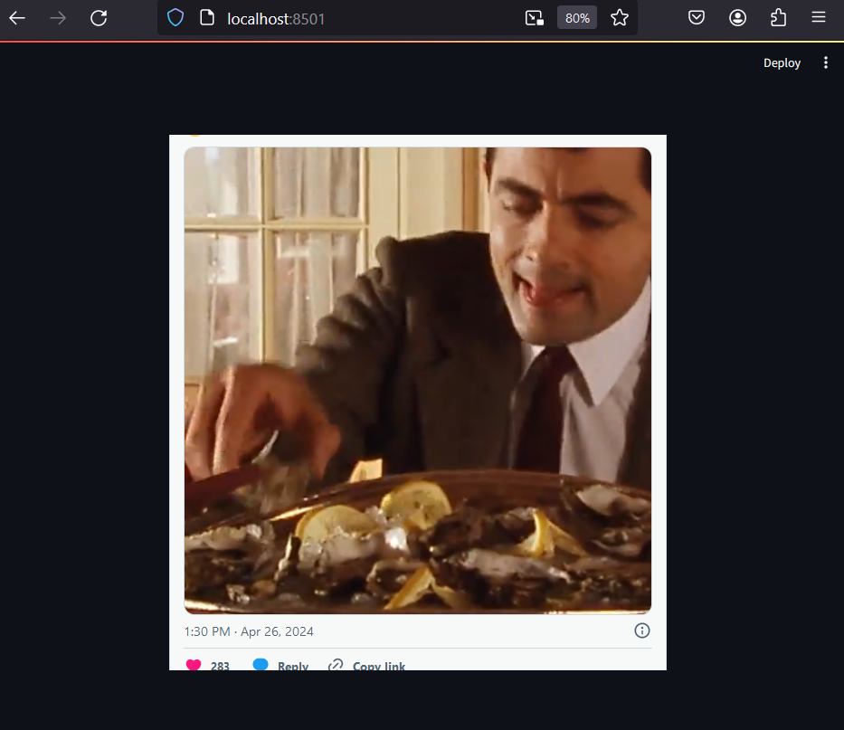

# EmbedLit
Embed your social media content and other online stuff with ease on Streamlit dashboards

## Usage

### Install the package from PYPI

```python
pip install embedlit
```
### Import the package

```python
from embedlit import *
hello()
```
Running `hello()` should give you a simple welcome message -
```
Hello there 👋 
Welcome to embedlit! 🚀
```
### Embed Twitter Post

```python
from embedlit import *
tweet_embed(tweet_url = "https://x.com/MrBean/status/1783767984194118058", 
            height = 600, 
            alignment = 'center')
```

